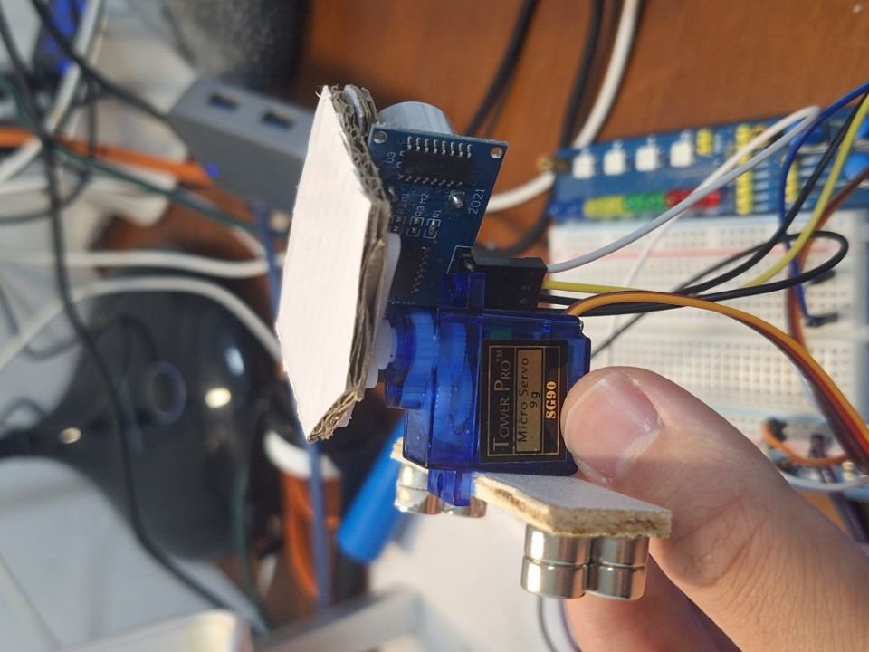
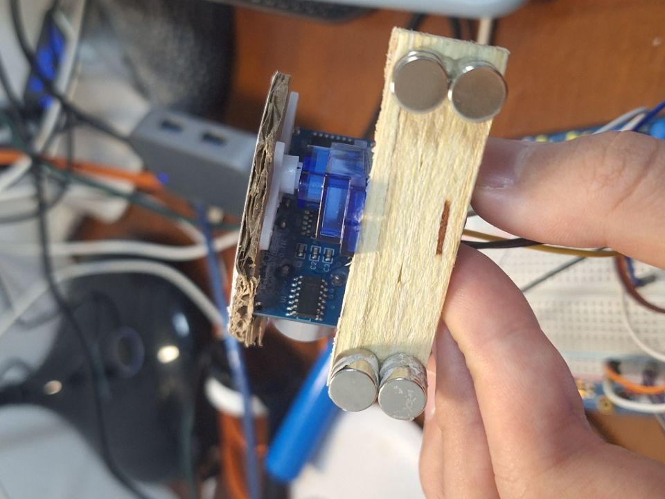
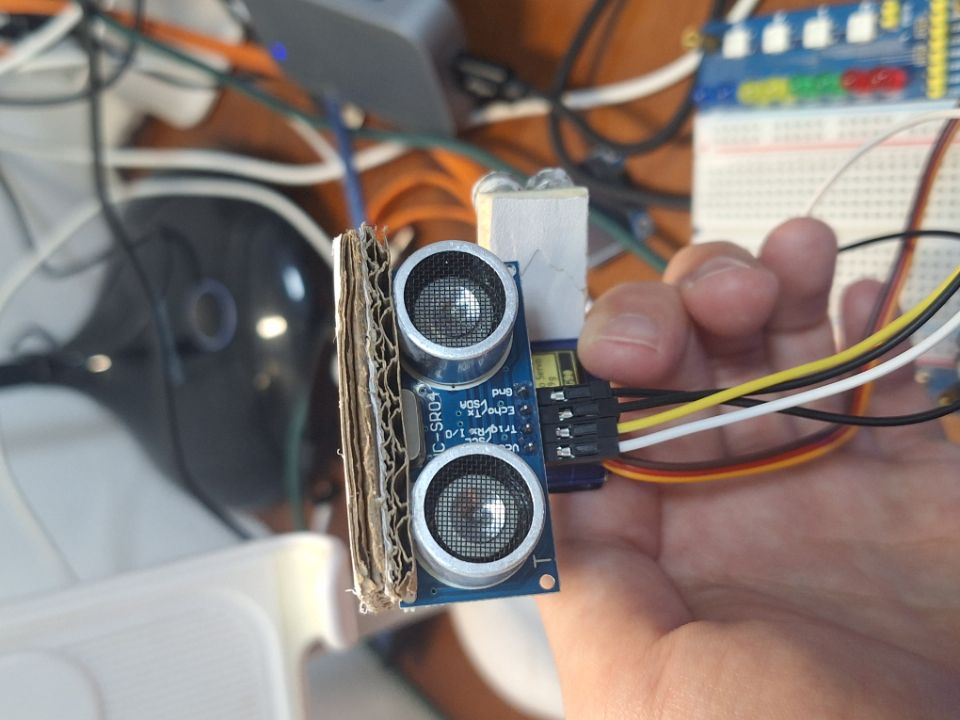
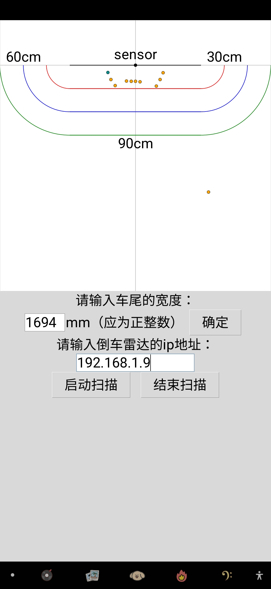

这是一个可以旋转扫描的倒车雷达，它由两个部分组成，一个是角度舵机，另一个是超声波测距仪，组装效果如图所示：

使用前的准备：

一、将引脚按照如下方式连接：

1.角度舵机：

红色线：接5v电源（或能输出5v的引脚）

棕色线：接地

黄色线：GP16

2.超声波测距仪：

Vcc：接5v电源（或能输出5v的引脚）

Trig：GP22

Echo：GP32

Gnd：接地

二、修改ESP32/main.py中35和39行的网络名和密码。修改完后，将hcsr04.py、main.py、servo.py统统烧录进ESP32中。

三、在手机端或电脑端运行ParkingSensor.py，ESP32端运行main.py。将ESP32端的ip地址输入手机APP中的相应位置即可实现通讯（需两者都使用同一个WIFI）

